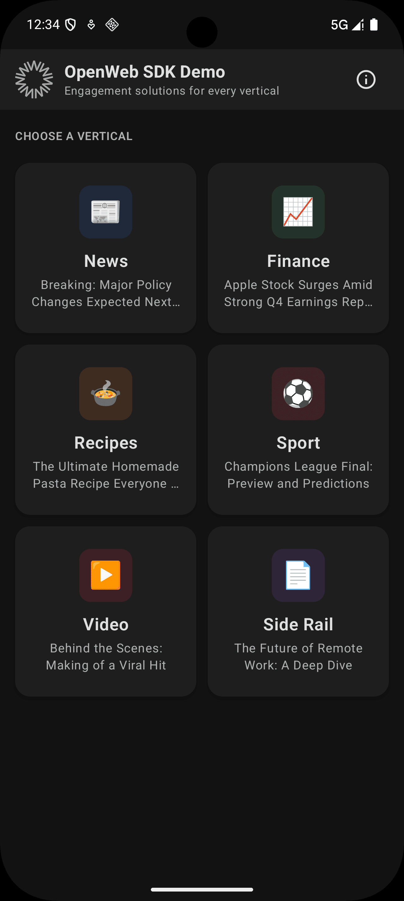
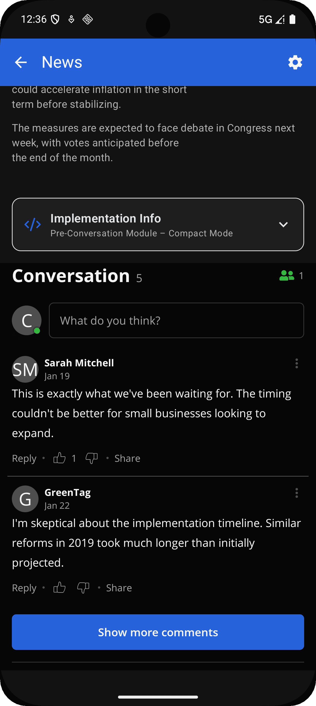
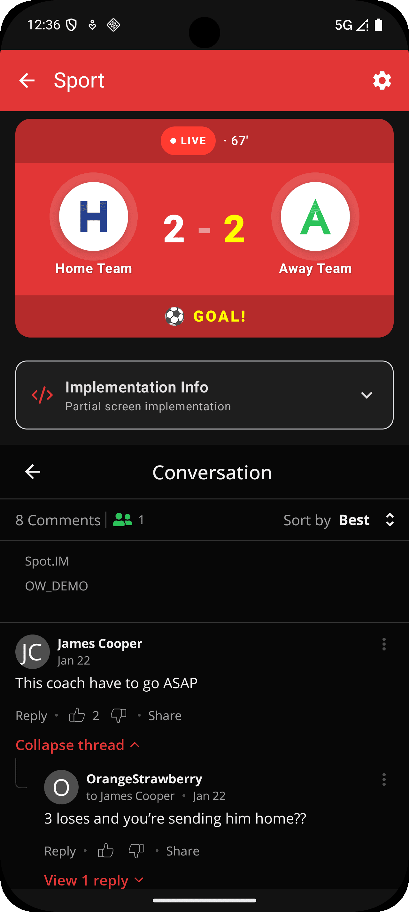
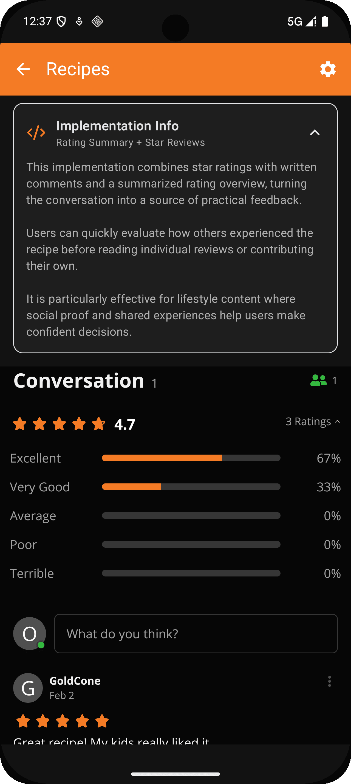
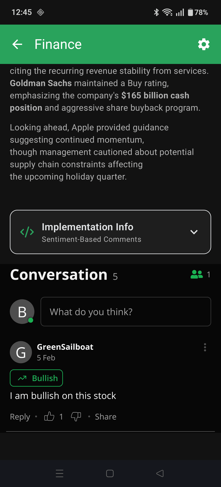
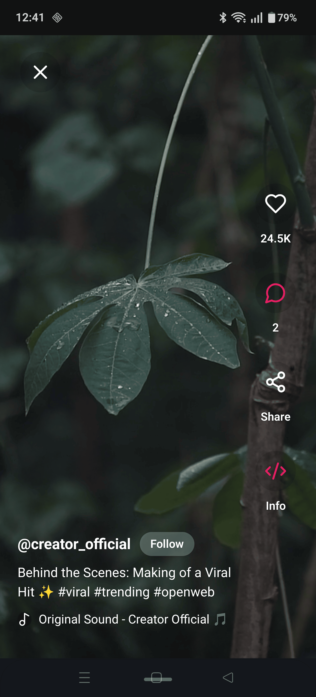

<p align="center">
  
</p>

<h1 align="center">OpenWeb Android Sample App</h1>

<p align="center">
  A sample application demonstrating integration of the <a href="https://www.openweb.com/">OpenWeb SDK</a> into an Android app.<br/>
  Showcases commenting and community engagement features across multiple content verticals.
</p>

---

## Screenshots

<table align="center">
  <tr>
    <td align="center"><br/><sub>Home</sub></td>
    <td align="center"><br/><sub>News</sub></td>
    <td align="center"><br/><sub>Sport</sub></td>
  </tr>
  <tr>
    <td align="center"><br/><sub>Recipes</sub></td>
    <td align="center"><br/><sub>Finance</sub></td>
    <td align="center"><br/><sub>Video</sub></td>
  </tr>
</table>

---

## Project Structure

```
openweb-android-sample-app/
├── sample-app/          # Main application module
│   └── src/
│       ├── main/        # Shared code and resources
│       ├── public/      # Public build variant (open-source entry point)
│       └── internal/    # Internal build variant (SDK development)
├── build-logic/         # Shared Gradle convention plugins
└── gradle/              # Version catalogs
```

## Content Verticals

| Vertical | Highlights |
|----------|------------|
| **News** | Article with standard conversation view and compact pre-conversation module |
| **Finance** | Sentiment-tagged comments — readers mark posts as Bullish, Neutral, or Bearish |
| **Sport** | Live score widget embedded above a threaded conversation |
| **Recipes** | Star rating summary combined with written reviews |
| **Video** | Full-screen TikTok-style player with floating engagement overlay |
| **Side Rail** | Conversation in a side panel layout |

## Resources

- [OpenWeb SDK Documentation](https://developers.openweb.com/docs/android-social-sdk-getting-started)
- [Release Notes](https://updates.openweb.com/announcements/android-sdk-release-notes)
